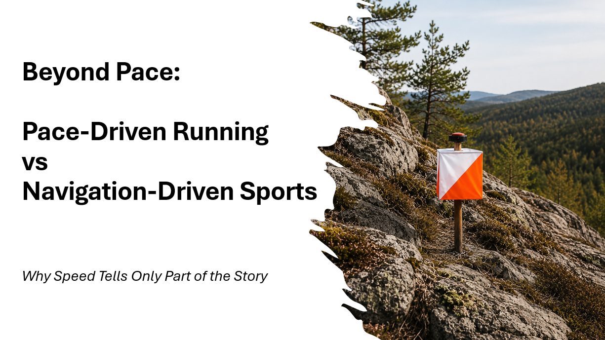
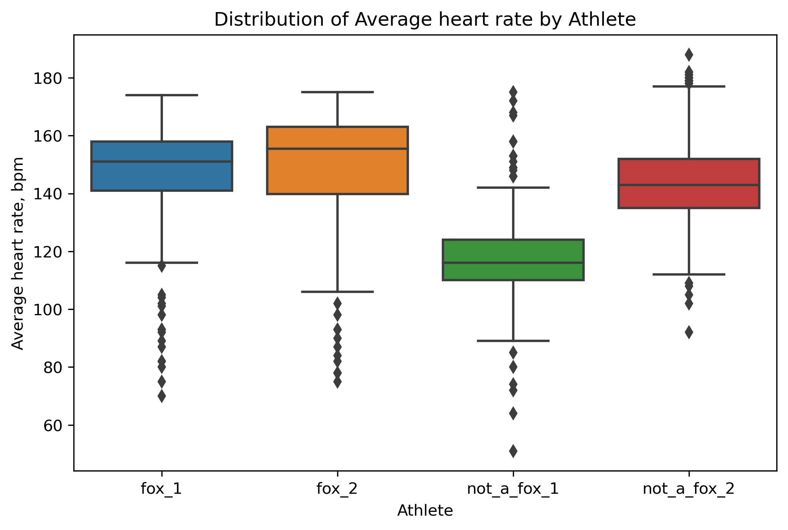
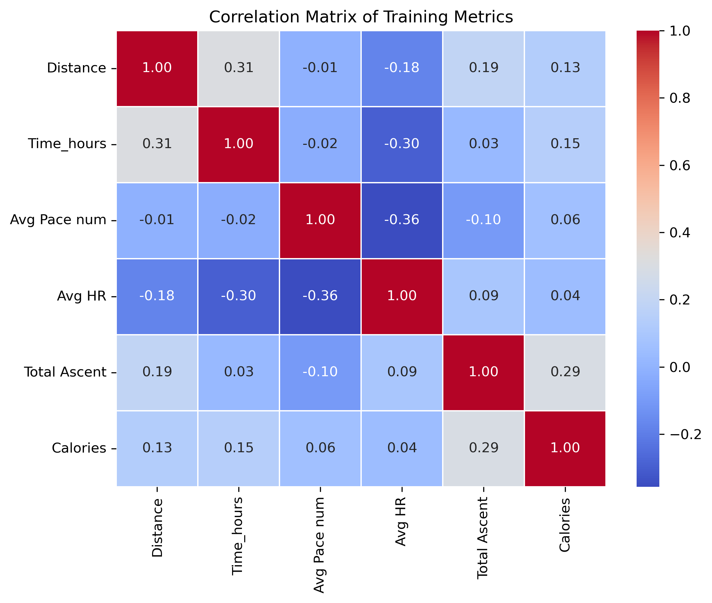
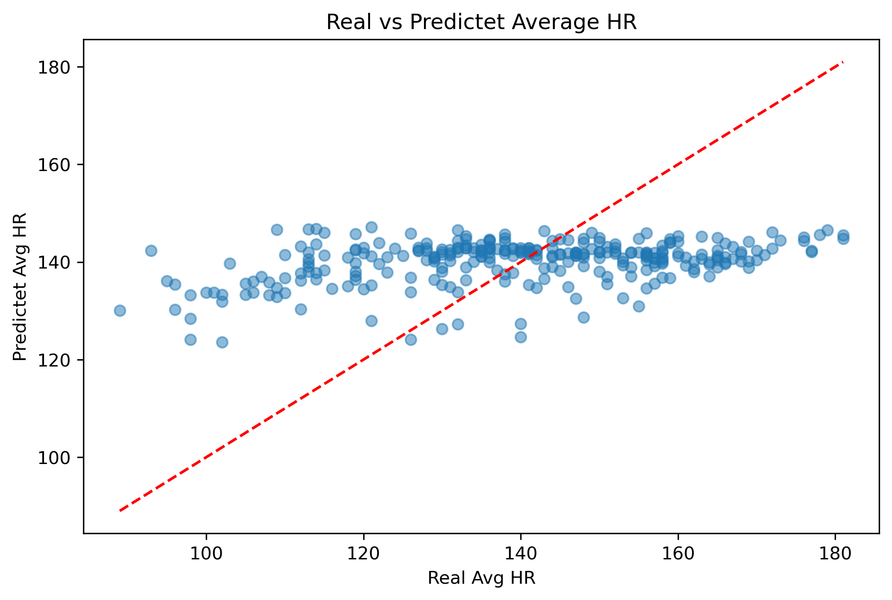

# Beyond Pace: Navigation-Driven vs Pace-Driven Athletes
## or Why Speed Tells Only Part of the Story

**Python · Power BI**



## Overview
Standard running metrics — pace, speed, distance — work well for road runners.
But what about athletes who navigate forests, read maps, and make split-second 
route decisions under physical load?

This project compares **two navigation-driven athlete profiles** (Orienteering & ARDF) 
with **two pace-driven runners** using real Garmin Connect data to show that 
pace alone is insufficient to evaluate performance in navigation-driven sports.

> *"Profiles, not people"* — each dataset represents an activity profile, 
> not an individual.

**What is navigation-driven sports**
These are a unique category of athletic activities where a participant's success depends equally on their physical endurance and their ability to actively find their way through an environment. Instead of following a fixed, clearly marked track athletes must use tools like maps, compasses or even radio direction finding apparatus to navigate through diverse wooded terrain to locate specific checkpoints.
In this research we are talking about 2 types of Navigation-Driven Sports: Orienteering and ARDF.


**Pipeline:** Garmin Connect → Python/Pandas → Power BI

## Links
- [Power BI Dashboard](https://app.powerbi.com/view?r=eyJrIjoiMTgxN2YzYmItZDY0OC00NzY3LTgxODgtNjYzMzVkZmM1ZjMyIiwidCI6ImRmODY3OWNkLWE4MGUtNDVkOC05OWFjLWM4M2VkN2ZmOTVhMCJ9&embedImagePlaceholder=true&pageName=cdb2f063caf280b05329)
- [Notebook 01: Loading & Cleaning](notebooks/01_loading_cleaning.ipynb)
- [Notebook 02: EDA](notebooks/02_eda.ipynb)
- [Notebook 03: ML](notebooks/03_ml.ipynb)

## Dataset
Garmin Connect exports — 4 athlete profiles — ~1,876 activity records.

Athlete profiles:
- "fox_1" — navigation-driven (Orienteering & ARDF)
- "fox_2" — navigation-driven (Orienteering & ARDF)
- "not_a_fox_1" — pace-driven runner
- "not_a_fox_2" — pace-driven runner

## What I Did
- Loaded and cleaned 4 Garmin Connect CSV exports
- Detected and removed GPS anomalies caused by air defense interference during
  wartime conditions in Ukraine, 2026
- Built 10 research questions with visualizations and observations
- Compared pace, HR, elevation, distance, and training volume across profiles
- Built a linear regression model to predict HR from pace and elevation
- Created a 2-page interactive Power BI dashboard

## Key Metrics
| Metric | Value |
|---|---|
| Total activity records | 1,876 |
| Date range | 2011 – 2026 |
| Athlete profiles | 4 |
| ML model R² | 0.117 |
| ML model MAE | ~16 bpm |

## Key Findings

**1 out of 10 questions showed no difference between athlete types.**
Distance distribution reflects individual training habits — not the sport itself.
Everything else confirmed the gap.


**Pace variability is the navigation effect in the data.**
fox_1 and fox_2 show pace from 1 to 55 min/km in normal activities —
not anomalies, but map checks, swamps, climbs, and route decisions.
not_a_fox_2 shows std = 1.05. Same sport category. Completely different world.


**Heart rate runs high — but drops suddenly.**
Navigation-driven athletes operate near maximum HR,
then stop almost completely to read a map or assess terrain.
Those drops show up as low-end outliers. Pace-driven athletes don't have them.



**No strong correlations — and that's the finding.**
Metrics that should be connected aren't.
Because in navigation-driven sports, a third factor always stands between
physical effort and measurable output: the decision.



**A weak ML model (R² = 0.117) confirms the thesis.**
Pace and elevation explain only 12% of heart rate variation.
The model failed to predict — and proved the point.



---

> In navigation-driven sports, shorter distance can mean a better route choice.
> Elevation has no single interpretation — sometimes avoiding a climb saves energy,
> sometimes cutting straight uphill wins the race.
> Pace and heart rate are never stable — you slow down to read a map,
> drop speed to check terrain, scramble up a slope, or wade through a swamp.
>
> What we consider "better" in running doesn't always apply here.
> **Comparing pace-driven and navigation-driven athletes on the same scale
> is meaningless — and this dataset shows exactly why.**


## Dashboard


[View Interactive Dashboard](https://app.powerbi.com/view?r=eyJrIjoiMTgxN2YzYmItZDY0OC00NzY3LTgxODgtNjYzMzVkZmM1ZjMyIiwidCI6ImRmODY3OWNkLWE4MGUtNDVkOC05OWFjLWM4M2VkN2ZmOTVhMCJ9&embedImagePlaceholder=true&pageName=cdb2f063caf280b05329)

## Repository Structure
```
Beyond_Pace/
├── README.md
├── notebooks/
│   ├── 01_loading_cleaning.ipynb
│   ├── 02_eda.ipynb
│   └── 03_ml.ipynb
├── data/
│   ├── raw/
│   └── processed/
├── images/
├── dashboard/
│   └── beyond_pace.pbix
└── requirements.txt
```
