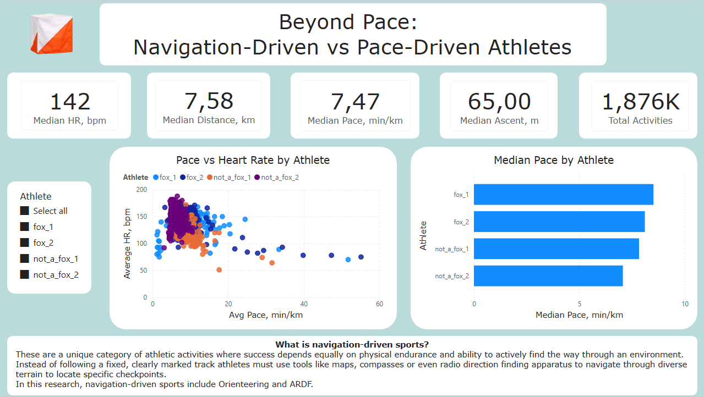
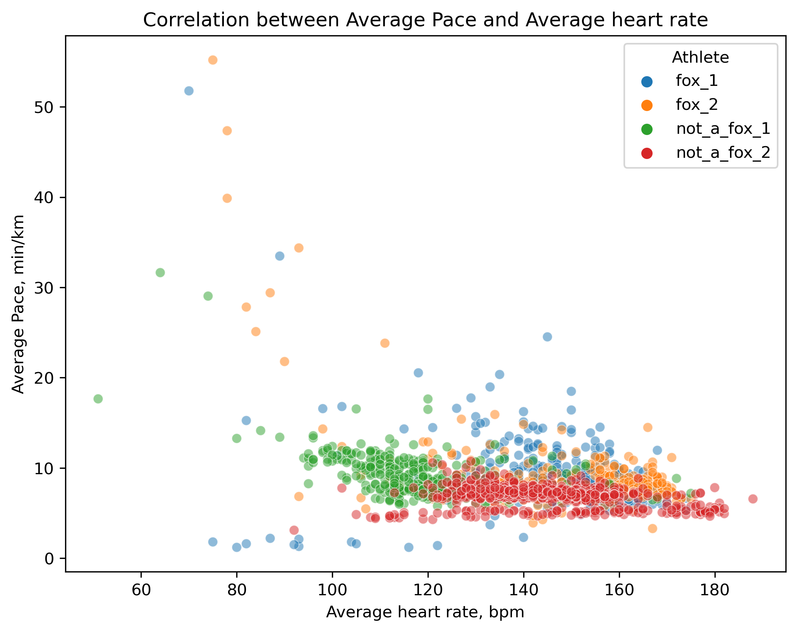
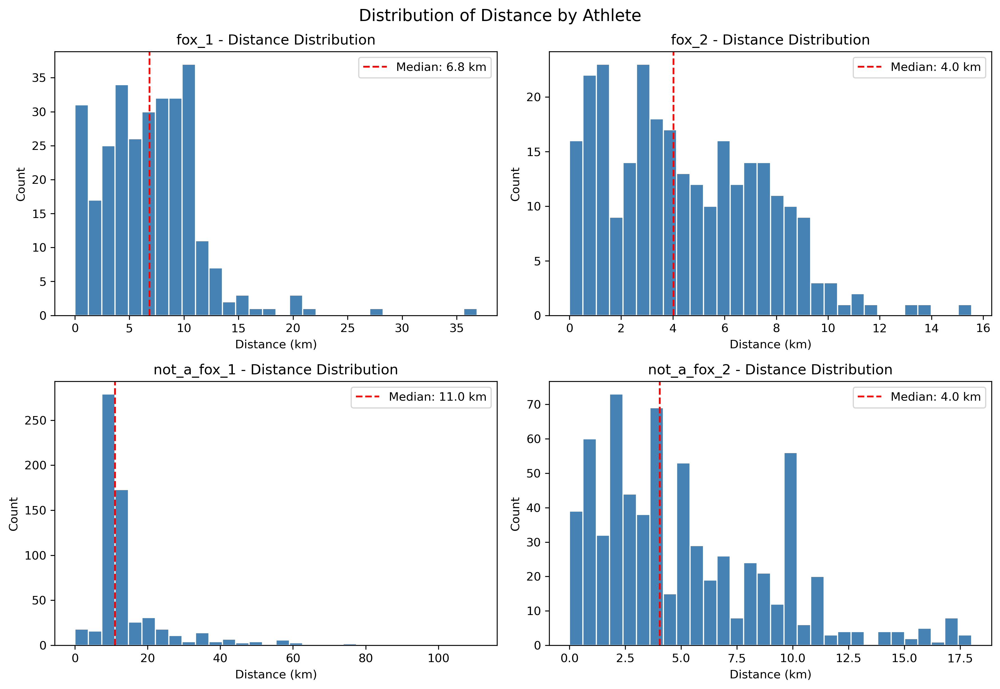
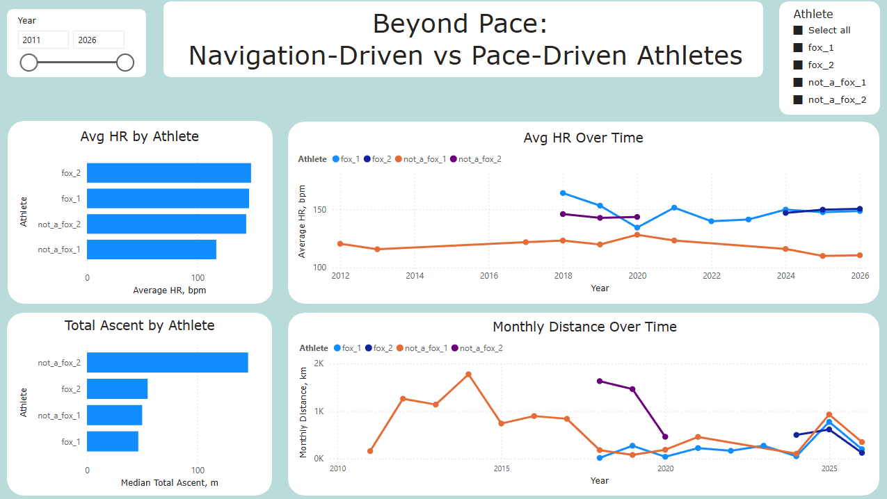

# Beyond Pace: Navigation-Driven vs Pace-Driven Athletes
## or Why Speed Tells Only Part of the Story

**Python · Power BI**



## Overview
Standard running metrics — pace, speed, distance — work well for road runners.
But what about athletes who navigate forests, read maps, and make split-second 
route decisions under physical load?

This project compares **two navigation-driven athlete profiles** (Orienteering & ARDF) 
with **two pace-driven runners** using real Garmin Connect data to show that 
pace alone is insufficient to evaluate performance in navigation-driven sports.

> *"Profiles, not people"* — each dataset represents an activity profile, 
> not an individual.

**What is navigation-driven sports**
These are a unique category of athletic activities where a participant's success depends equally on their physical endurance and their ability to actively find their way through an environment. Instead of following a fixed, clearly marked track athletes must use tools like maps, compasses or even radio direction finding apparatus to navigate through diverse wooded terrain to locate specific checkpoints.
In this research we are talking about 2 types of Navigation-Driven Sports: Orienteering and ARDF.


**Pipeline:** Garmin Connect → Python/Pandas → Power BI

## Links
- [Power BI Dashboard](https://app.powerbi.com/view?r=eyJrIjoiMTgxN2YzYmItZDY0OC00NzY3LTgxODgtNjYzMzVkZmM1ZjMyIiwidCI6ImRmODY3OWNkLWE4MGUtNDVkOC05OWFjLWM4M2VkN2ZmOTVhMCJ9&embedImagePlaceholder=true&pageName=cdb2f063caf280b05329)
- [Notebook 01: Loading & Cleaning](notebooks/01_loading_cleaning.ipynb)
- [Notebook 02: EDA](notebooks/02_eda.ipynb)
- [Notebook 03: ML](notebooks/03_ml.ipynb)

## Dataset
Garmin Connect exports — 4 athlete profiles — ~1,876 activity records.

Athlete profiles:
- "fox_1" — navigation-driven (Orienteering & ARDF)
- "fox_2" — navigation-driven (Orienteering & ARDF)
- "not_a_fox_1" — pace-driven runner
- "not_a_fox_2" — pace-driven runner

## What I Did
- Loaded and cleaned 4 Garmin Connect CSV exports
- Detected and removed GPS anomalies caused by air defense interference during
  wartime conditions in Ukraine, 2026
- Built 10 research questions with visualizations and observations
- Compared pace, HR, elevation, distance, and training volume across profiles
- Built a linear regression model to predict HR from pace and elevation
- Created a 2-page interactive Power BI dashboard

## Key Metrics
| Metric | Value |
|---|---|
| Total activity records | 1,876 |
| Date range | 2011 – 2026 |
| Athlete profiles | 4 |
| ML model R² | 0.117 |
| ML model MAE | ~16 bpm |

## Key Findings

**Pace variability reveals activity type.**
Navigation-driven athletes show pace ranging from 1 to 55 min/km within 
normal activities — not anomalies, but map checks, terrain, and route decisions.



**Heart rate cannot be predicted from pace and elevation alone.**
R² = 0.117 confirms that standard running metrics explain only ~12% of HR 
variation in navigation-driven sports.

**Distance reflects individual habits, not sport type.**
No shared distance pattern exists across profiles or even within the same 
activity category.



**Seasonal patterns are visible — and sport-specific.**
Navigation-driven athletes show winter drops linked to snow conditions and 
equipment constraints, not just weather.

**A weak ML model is a finding, not a failure.**
It confirms the core thesis: you cannot evaluate navigation-driven athletes 
with pace-driven metrics.

## Dashboard




[View Interactive Dashboard](https://app.powerbi.com/view?r=eyJrIjoiMTgxN2YzYmItZDY0OC00NzY3LTgxODgtNjYzMzVkZmM1ZjMyIiwidCI6ImRmODY3OWNkLWE4MGUtNDVkOC05OWFjLWM4M2VkN2ZmOTVhMCJ9&embedImagePlaceholder=true&pageName=cdb2f063caf280b05329)

## Repository Structure
```
Beyond_Pace/
├── README.md
├── notebooks/
│   ├── 01_loading_cleaning.ipynb
│   ├── 02_eda.ipynb
│   └── 03_ml.ipynb
├── data/
│   ├── raw/
│   └── processed/
├── images/
├── dashboard/
│   └── beyond_pace.pbix
└── requirements.txt
```
